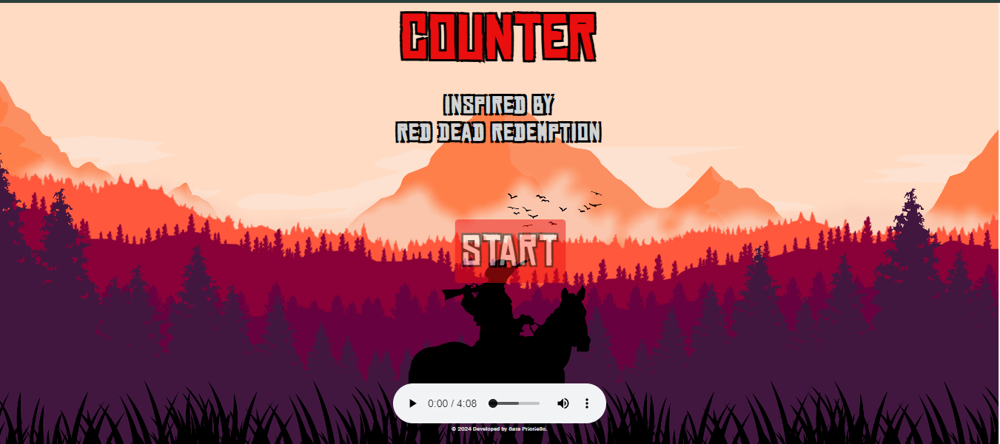

# Red Dead Redemption Counter

 *This screenshot showcases the desktop view of the Counter application inspired by Red Dead Redemption 2.*

This project was developed for the Front End Development course at Start2Impact University, focusing on "JavaScript Basics". The project consists of creating a simple application that functions as a counter. The goal is to develop a JavaScript application that allows the user to increase and decrease the counter value. When the user enters the page, they will see 0 as the counter value and will have three buttons "-", "reset", and "+" to modify the counter value. Pressing the "+" or "-" button will increment or decrement the counter value by one unit, accompanied by an animation of a broom flying from bottom to top for "+" and from top to bottom for "-". If the reset button is pressed, any ongoing animations will disappear, and the counter number will return to its starting point, which is "0". The application must be developed with JavaScript, without the use of jQuery or any frameworks (React, Angular, Vue...). The use of external JavaScript libraries is allowed if necessary. The +/- buttons and the display of the counter value must be implemented with JavaScript. All additional functionalities deemed necessary are allowed.

Since this project has been developed many times, I decided to do something different from the classic counter, adding some animations and sounds to it. I chose to base the project on one of my favorite video games, which I am deeply passionate about, namely Red Dead Redemption 2.

## Technical Path:

I recreated some elements, such as buttons, with a very simple design that visually recalls the RDR2 style, to which I decided to add a personal touch.
To start the counter, simply click on "start", after which, with a js function, a different background and buttons will be called. By clicking "+" you will have the animation and sound of a gunshot, while clicking "-" will trigger the voice of Arthur Morgan.

I added a background music set to auto-play for browsers that have the setting enabled, while for those that don't, there is the option to play the music using the controller at the bottom of the page. This is not visible on smartphones, to make the use of the counter more convenient.

During the creation process of this project, I encountered some initial difficulties, which I later solved thanks to advice on the study material. I am proud to have created something original entirely on my own, following a precise idea given by the exercise prompt but also allowing myself to be guided by inspiration and experimentation.

## Try the Counter!

Click [here](https://counter-rdr2.netlify.app/) to try our Counter inspired by Red Dead Redemption 2!
